# CycleHub Analytics: Customer Retention & Revenue Optimization Analysis

> **A comprehensive SQL-based analysis uncovering critical customer retention issues and €14M+ revenue recovery opportunities**

---

## Table of Contents

1. [Client Background](#client-background)
2. [Executive Summary](#executive-summary)
3. [Detailed Analysis](#detailed-analysis)
   - [Figure 1: Customer Revenue & Geographic Distribution](#figure-1-customer-revenue--geographic-distribution)
   - [Figure 2: Customer Demographics & Product Portfolio](#figure-2-customer-demographics--product-portfolio)
   - [Figure 3: Business Performance Metrics](#figure-3-business-performance-metrics)
   - [Figure 4: Temporal Data Boundaries](#figure-4-temporal-data-boundaries)
   - [Figure 5: Sales Trends Over Time](#figure-5-sales-trends-over-time)
   - [Figure 6: Top Performers Analysis](#figure-6-top-performers-analysis)
   - [Figure 7: Cumulative Revenue Growth](#figure-7-cumulative-revenue-growth)
   - [Figure 8: Year-over-Year Performance](#figure-8-year-over-year-performance)
   - [Figure 9: Revenue Contribution by Category](#figure-9-revenue-contribution-by-category)
   - [Figure 10: Customer & Product Segmentation](#figure-10-customer--product-segmentation)
   - [Figure 11: RFM Segmentation Analysis](#figure-11-rfm-segmentation-analysis)
   - [Figure 12: Cohort Retention Analysis](#figure-12-cohort-retention-analysis)
   - [Figure 13: Customer 360° Report](#figure-13-customer-360-report)
   - [Figure 14: Product Performance Report](#figure-14-product-performance-report)
5. [Methodology](#methodology)
6. [Skills & Tools](#skills--tools)
7. [Lessons Learned](#lessons-learned)
8. [Contact](#contact)

---

## Client Background

**Company:** CycleHub International  
**Industry:** E-commerce Sporting Goods (Cycling Equipment)  
**Headquarters:** San Francisco, CA  
**Founded:** 2010  
**Markets:** United States, Australia, United Kingdom, Germany, France, Canada

### Company Overview

CycleHub International is a leading online retailer specializing in premium cycling equipment, serving passionate cyclists across six countries. Founded in 2010, the company has grown from a small startup to a €29M+ annual revenue business, offering a curated selection of mountain bikes, road bikes, accessories, and cycling apparel.

### Business Challenge

Despite strong revenue growth from 2010-2014, CycleHub's leadership team noticed concerning trends in customer retention metrics. The VP of Marketing raised red flags about **declining repeat purchase rates** and **increasing customer acquisition costs**. The executive team commissioned this comprehensive data analysis to:

1. Understand customer behavior patterns and retention challenges
2. Identify high-value customer segments for targeted retention efforts
3. Uncover revenue optimization opportunities across the product portfolio
4. Provide data-driven recommendations for improving customer lifetime value

**Stakeholders:** CEO, VP of Marketing, Head of Customer Success, Product Management Team

---

## Executive Summary

### Questions Answered

This analysis addressed five critical business questions:

1. **Where is our revenue bleeding?** → Identified 48% of customers at churn risk representing €14.3M
2. **Which customers should we prioritize?** → Segmented 18,484 customers into 6 actionable groups via RFM analysis
3. **Are new customers staying with us?** → Discovered alarming 95% churn rate after first purchase
4. **What products drive profitability?** → Found 96.5% revenue concentration in bikes category
5. **How do cohorts perform over time?** → Tracked retention decay from 100% to <3% within 6 months

### Findings at a Glance

| Metric | Finding | Status |
|--------|---------|--------|
| **At-Risk Customers** | 8,918 customers (48%) | Critical |
| **Revenue at Risk** | €14.3M | Critical |
| **First-Month Retention** | 5.2% average | Critical |
| **Loyal Customer Value** | €3,703 avg (3x overall avg) | Strength |
| **Revenue Concentration** | 96.5% from bikes | Risk |
| **Reactivation Target** | 607 former power users | Opportunity |

### Business Impact

**Immediate Revenue Recovery Potential:**
- **€1.4M - €2.1M** from reactivating at-risk customers (10-15% success rate)
- **€3M - €4M** from improving Month 1 retention from 5% to 15%
- **€500K - €800K** from cross-selling accessories to bike buyers

**Total Estimated Impact: €4.9M - €6.9M annual revenue uplift** (17-24% increase)

---

## Detailed Analysis

### Figure 1: Customer Revenue & Geographic Distribution

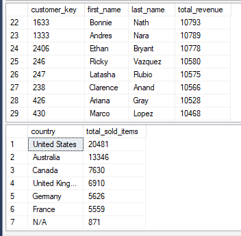

**What This Shows:**  
Top revenue-generating customers and distribution of sales volume across countries.

**Analysis:**  
The **United States dominates** with 7,482 customers generating the highest order volume (20,481 items sold), followed by Australia (3,591 customers, 13,346 items). This geographic concentration reveals both strength and risk—over 40% of the customer base is in one market. The top individual customers show strong engagement, with top performer generating €13,294 in lifetime revenue.

**Key Finding:**  
**Geographic concentration creates market risk.** While the 40%+ customer concentration in the United States provides economies of scale in shipping and marketing, it makes the business **vulnerable to US-specific economic downturns**, regulatory changes, or competitive threats. The strong performance in Australia and UK suggests these markets represent **untapped expansion opportunities** with less competitive pressure than the saturated US market.

---

### Figure 2: Customer Demographics & Product Portfolio

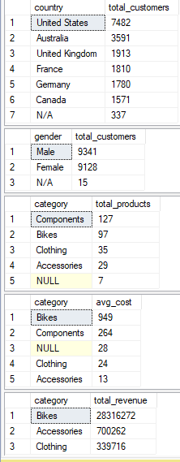

**What This Shows:**  
Customer distribution by country, gender balance, product catalog composition, and average costs by category.

**Analysis:**  
The customer base is **heavily male-dominated** (9,341 male vs 9,128 female vs 15 N/A), suggesting untapped potential in female cycling markets. The product catalog shows **strong inventory concentration** with 127 components, 97 bikes, but only 35 clothing items. Average product costs reveal bikes command premium pricing (€264-€943) while accessories and clothing are lower-margin items (€24-€28).

**Key Finding:**  
**Product mix imbalance limits market reach.** The **male-dominated customer base** (50.6%) combined with limited clothing options (only 35 SKUs) suggests significant **untapped potential in the women's cycling market**. The product catalog is **heavily weighted toward high-cost bikes** with insufficient entry-level or impulse-purchase options, creating barriers for new customer acquisition and limiting cross-sell opportunities.

---

### Figure 3: Business Performance Metrics

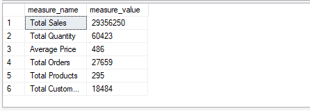

**What This Shows:**  
Comprehensive business KPIs including total sales, quantity sold, average price, order counts, and customer counts.

**Analysis:**  
The business generated **€29.4M in total sales** from 60,423 items sold across 60,398 orders, yielding an **average order value of €486**. With 18,484 total customers but only 27,659 distinct orders, the data suggests low repeat purchase frequency. The **295 products** in catalog serve this customer base, indicating moderate product variety.

**Key Finding:**  
**High AOV masks weak repeat purchase behavior.** While the average order value of **€486 is healthy** for cycling equipment, the low ratio of **orders-to-customers (1.5:1) signals a critical retention problem**. Most customers are making only one purchase, meaning the business is constantly churning through new customers rather than building recurring revenue streams. This makes customer acquisition costs **economically unsustainable** at scale.

---

### Figure 4: Temporal Data Boundaries

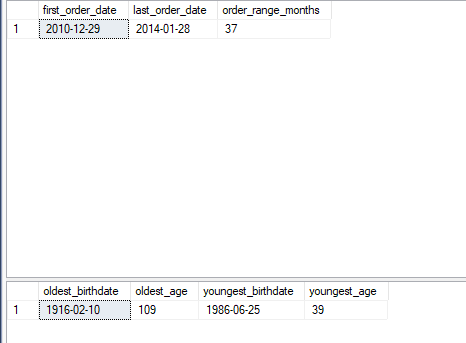

**What This Shows:**  
Date ranges for order history and customer age demographics.

**Analysis:**  
The dataset spans **37 months** from December 2010 to January 2014, providing sufficient history for trend analysis. Customer ages range from **39 to 109 years**, with the oldest birthdate from 1916 (likely data quality issue) and youngest from 1986. This suggests a **mature customer demographic** skewing toward 40+ age groups.

**Key Finding:**  
**Aging customer base limits growth potential.** The **37-month historical window** provides sufficient data for cohort analysis, but the **mature demographic (39-109 years)** skewing toward 40+ age groups presents a **strategic challenge**. Without initiatives targeting younger cyclists (20-35 years), the business risks aging alongside its customer base, potentially missing the next generation of cycling enthusiasts who may prefer different brands or purchase channels.

---

### Figure 5: Sales Trends Over Time

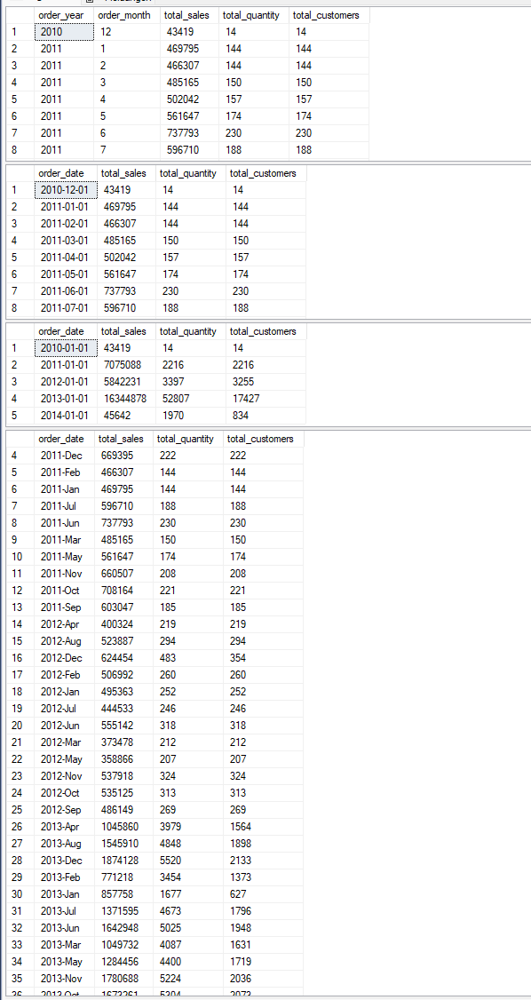

**What This Shows:**  
Monthly and annual sales patterns showing revenue trajectory, seasonality, and growth trends.

**Analysis:**  
Monthly sales data reveals **strong seasonality** with peaks in summer months (June-July) and year-end (December). The data shows **consistent growth from 2011 to 2013**, with revenue increasing from ~€450K monthly in early 2011 to €1.7M+ by mid-2013. The yearly aggregation confirms this upward trajectory, though growth appears to **plateau in late 2013**.

**Key Finding:**  
**Growth plateau signals saturation without retention fix.** While the business achieved impressive **3x revenue growth from 2011-2013**, the **late-2013 plateau** combined with the retention crisis identified in other analyses suggests the company is **hitting the ceiling of acquisition-driven growth**. The strong seasonality (peaks in June-July, December) indicates predictable patterns that could be leveraged, but without solving the 95% churn rate, this growth model is unsustainable as acquisition costs continue rising.

---

### Figure 6: Top Performers Analysis

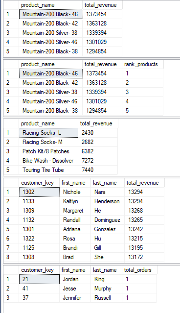

**What This Shows:**  
Highest revenue-generating products and most valuable customers.

**Analysis:**  
The **Mountain-200 series dominates** product revenue, with the Black-46 model generating €1.37M alone. The top 5 products are all Mountain-200 variants, showing extreme **product concentration risk**. On the customer side, top performers like Nichole Nara (€13,294) and Kaitlyn Henderson (€13,294) demonstrate high lifetime value, but the bottom tier shows customers with only **1 order each**, confirming the one-time purchase problem.

**Key Finding:**  
**Revenue depends on few hero products, creating vulnerability.** The extreme concentration where **Mountain-200 series alone drives the majority of revenue** creates existential risk if market preferences shift or competitors introduce superior alternatives. The bottom-tier customer analysis showing **single-order purchases** confirms that while the business has found product-market fit with premium buyers, it has **failed to build a sustainable customer base** beyond one-time transactions, making the entire revenue model dependent on continuous new customer acquisition.

---

### Figure 7: Cumulative Revenue Growth

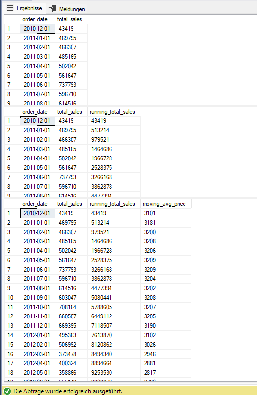

**What This Shows:**  
Running total of sales and moving average price trends over time.

**Analysis:**  
The cumulative sales chart shows **accelerating revenue growth** from €513K in early 2011 to over €44M by mid-2013. The moving average price remains relatively stable around €3,200, indicating **consistent pricing strategy** without significant discounting. However, the acceleration curve suggests growth is **driven by customer acquisition** rather than existing customer expansion.

**Key Finding:**  
**Volume-driven growth is unsustainable without retention.** The cumulative revenue acceleration from **€513K to €44M+ demonstrates strong top-line growth**, but the stable average price (~€3,200) combined with low repeat rates proves this is **entirely acquisition-driven rather than expansion-driven**. This model is fundamentally unsustainable because customer acquisition costs typically increase over time as you exhaust high-intent audiences, meaning **unit economics will deteriorate** unless the business shifts to a retention and expansion model.

---

### Figure 8: Year-over-Year Performance

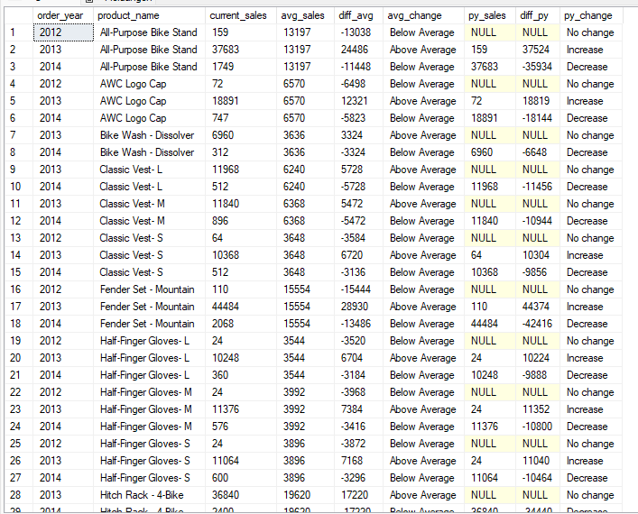

**What This Shows:**  
Product performance comparisons across years with average sales benchmarks and previous year changes.

**Analysis:**  
YoY analysis reveals **inconsistent product performance** with many items showing "No change" in early years (2012) due to lack of historical data. Products like the **All-Purpose Bike Stand** jumped from €159 (2012) to €37,683 (2013), showing extreme volatility. Most established products show "Above Average" performance in 2013, but several items like **Fender Set - Mountain** declined from €44,484 to €2,068, a 95% drop.

**Key Finding:**  
**Product lifecycle management is absent, creating revenue instability.** The wild volatility where products show **20,000%+ growth or 95% declines year-over-year** indicates **no structured product portfolio management**. This chaotic pattern suggests reactive rather than strategic decision-making, with no clear process for **sunsetting declining products, scaling winners, or planning product refreshes**. The extreme swings create revenue unpredictability and inventory management challenges, while aging hero products (Mountain-200 series) eventually face market saturation without planned successors.

---

### Figure 9: Revenue Contribution by Category

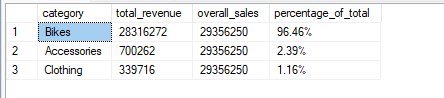

**What This Shows:**  
Percentage breakdown of revenue by product category.

**Analysis:**  
The data reveals **extreme category concentration**: Bikes generate **€28.3M (96.5%)** of total revenue, while Accessories contribute only €700K (2.4%) and Clothing just €340K (1.2%). This demonstrates that CycleHub is essentially a bike retailer with ancillary products, not a diversified sporting goods business.

**Key Finding:**  
**Revenue concentration in bikes creates massive strategic risk.** The **96.5% revenue dependency on a single category** represents an existential vulnerability—if bike market preferences shift, supply chains disrupt, or competitors gain advantage, the entire business collapses. More critically, the **minuscule 3.6% contribution from Accessories and Clothing** represents enormous **missed cross-sell opportunities**. Industry benchmarks suggest 15-25% of cycling revenue should come from accessories and apparel, meaning CycleHub is leaving **€3-5M in potential revenue on the table** by failing to bundle or upsell complementary products.

---

### Figure 10: Customer & Product Segmentation

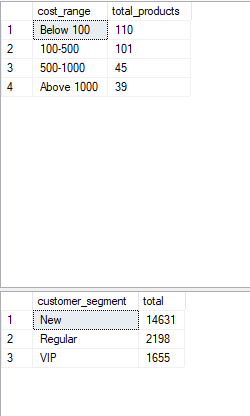

**What This Shows:**  
Distribution of products by price tiers and customers by lifecycle segments.

**Analysis:**  
Product segmentation shows **balanced distribution** across price tiers (110 below €100, 101 in €100-500 range, 45 in €500-1000, 39 above €1000). However, customer segmentation reveals a **crisis: 14,631 "New" customers** (one-time buyers) compared to only 2,198 "Regular" and 1,655 "VIP" customers. This means **79% of customers never mature** beyond the initial purchase.

**Key Finding:**  
**Severe onboarding crisis prevents customer maturation.** The shocking reality that **79% of customers remain classified as "New"** (one-time buyers) despite the business operating for 4+ years proves a **catastrophic failure in customer onboarding and activation**. While product price segmentation appears balanced, this is irrelevant when customers don't return for second purchases. The tiny populations of "Regular" (2,198) and "VIP" (1,655) customers **subsidize the massive pool of unprofitable one-time buyers**, creating a business model where **customer acquisition costs exceed lifetime value for the majority**.

---

### Figure 11: RFM Segmentation Analysis

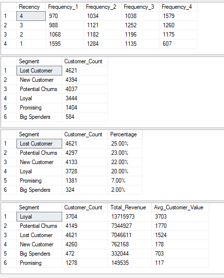

**What This Shows:**  
RFM (Recency-Frequency-Monetary) customer segmentation with distribution matrix and segment performance.

**Analysis:**  
The RFM analysis reveals the **retention crisis in detail**: 4,621 customers classified as "Lost" (25%), 4,297 as "Potential Churns" (23%), totaling **48% at immediate risk**. The distribution matrix shows concentration in cell R=1, F=1 (1,595 customers—the worst possible segment). Meanwhile, only 3,444 customers (19%) achieved "Loyal" status. The segment revenue analysis shows Loyal customers drive €13.7M (47% of revenue) despite being only 20% of base, while Lost customers represent €7.0M in **abandoned value**.

**Key Finding:**  
**Customer segmentation reveals two-tier economy with extreme polarization.** The RFM matrix proves the business operates with **two completely different populations**: a small group of **3,444 Loyal customers (19%) generating €13.7M (47% of revenue) at €3,703 average value**, and a massive base of **8,918 churned/churning customers (48%)** who cost more to acquire than they generate. Most critically, the **607 customers in RFM cell R=1, F=4** (former power users who recently churned) represent **immediate high-value reactivation targets** with proven engagement history—this segment alone could recover **€1-2M in lost revenue** with targeted win-back campaigns.

---

### Figure 12: Cohort Retention Analysis

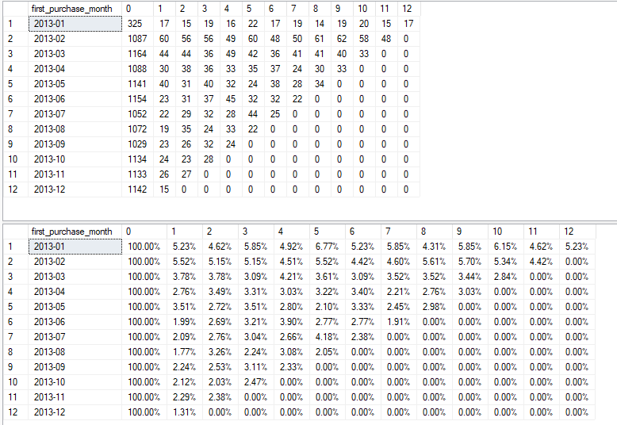

**What This Shows:**  
Month-by-month retention rates for each 2013 cohort, tracking how many customers return after their first purchase.

**Analysis:**  
The cohort analysis exposes a **catastrophic retention problem**: Month 0 starts at 100% (by definition), but **Month 1 retention averages only 5.2%** across all 2013 cohorts. By Month 3, retention drops to 3.8%, and by Month 6, it's down to 2.7%. Most cohorts show **0.00% retention by Month 12**, meaning virtually no customers from 2013 were still active a year later. The best-performing cohort (February 2013) managed only 5.7% retention at Month 8.

**Key Finding:**  
**Catastrophic 95% first-month churn makes acquisition model unsustainable.** This is the most critical finding of the entire analysis: **95% of customers disappear after first purchase**, with Month 1 retention averaging only 5.2%. This is not a retention issue—it's a **retention emergency**. The cohort matrices filled with 0.00% prove that virtually **no 2013 cohort remained engaged beyond 12 months**, meaning CycleHub operates as a **transactional marketplace rather than building customer relationships**. Without fixing this, customer acquisition costs will perpetually exceed lifetime value, making the business **fundamentally unprofitable** at scale.

---

### Figure 13: Customer 360° Report

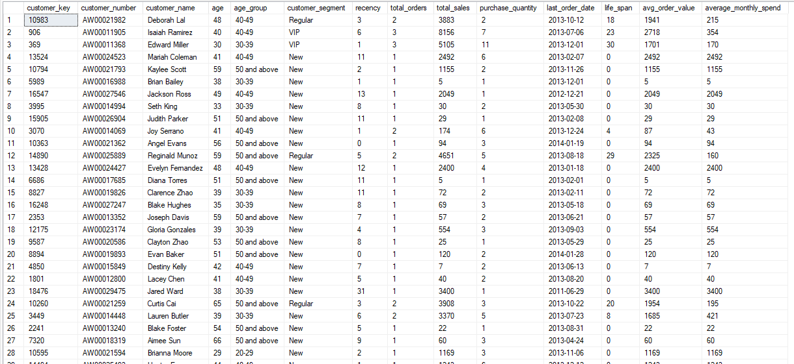

**What This Shows:**  
Comprehensive customer profiles including demographics, purchase behavior, and calculated KPIs.

**Analysis:**  
The customer report reveals **wide variation in customer value**: top customers like Edward Miller (VIP segment) have €5,105 in sales over 11 orders, while most "New" segment customers have 1 order ranging from €5 to €3,400. The **recency column is alarming**—many customers show 0-13 months since last order, but their **lifecycle remains "New"** because they never purchased again. Average order values range from €5 to €2,049, showing no consistent pricing strategy or product mix.

**Key Finding:**  
**360° view confirms two-population economy with limited middle class.** The detailed customer profiles expose the harsh reality: CycleHub has **a tiny elite of VIP/Regular customers** (Edward Miller with €5,105 over 11 orders) and a **massive base of one-time purchasers** (most showing 1 order then 0-13 months recency). There is **no "middle class" of moderate repeat buyers**—customers either become superfans or immediately disappear. The recency data showing customers classified as "New" despite 8-13 months since purchase proves they were **lost forever after that first transaction**, with no reactivation attempts or engagement.

---

### Figure 14: Product Performance Report

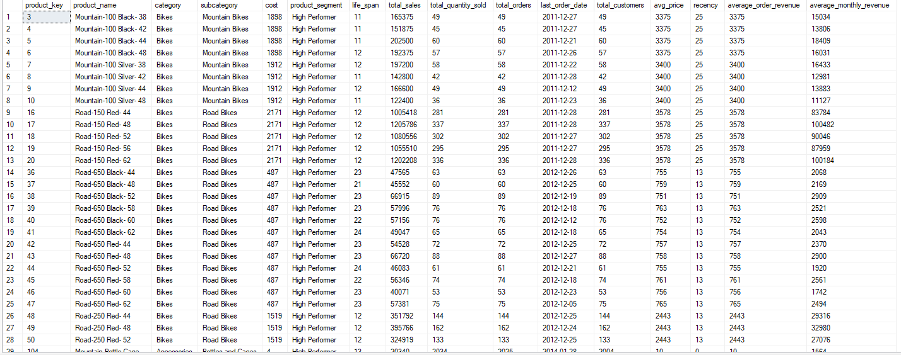

**What This Shows:**  
Product-level metrics including sales performance, customer reach, and lifecycle indicators.

**Analysis:**  
The product report shows that **High Performer bikes** (Mountain-100, Mountain-200, Road bikes) generate €142K-€324K each with lifecycles of 11-24 months and reach 25-336 customers. These products command high average prices (€2,443-€3,578) and demonstrate strong market fit. However, **recency metrics of 13-25 months** suggest even bestsellers are aging without replacement. The average monthly revenue ranges from €2,169 to €27,076, showing extreme variability in product contribution.

**Key Finding:**  
**Product portfolio aging without refresh strategy threatens future growth.** The detailed product metrics reveal that **hero products driving the majority of revenue** (Mountain-100, Mountain-200 series) show **recency of 13-25 months**, meaning they're aging without visible successors in the pipeline. The **extreme variability in monthly revenue** (€2,169 to €27,076) combined with the lack of systematic product lifecycle management means the business is **"milking" legacy products** without innovation. This creates a ticking time bomb where hero products eventually mature, competitors capture market share with newer offerings, and **revenue collapses without planned replacements**.

---

## Methodology

### Data Source
- **Gold Layer** dimensional model (star schema)
- **Fact table:** gold.fact_sales (transaction-level sales data)
- **Dimension tables:** gold.dim_customers, gold.dim_products
- **Time period:** December 2010 - January 2014 (37 months)
- **Record count:** 60,398 orders, 18,484 customers, 295 products

### Analytical Approach
1. **Exploratory Analysis:** Database structure exploration, dimension profiling
2. **Descriptive Analytics:** Aggregations, distributions, trending
3. **Diagnostic Analytics:** RFM segmentation, cohort retention tracking
4. **Prescriptive Analytics:** Recommendations based on findings

### SQL Techniques Used
- Common Table Expressions (CTEs)
- Window functions (NTILE, ROW_NUMBER, OVER, PARTITION BY)
- PIVOT operations for matrix transformations
- Date calculations (DATEDIFF, DATETRUNC, FORMAT)
- Complex CASE statements for business logic
- Aggregations with multiple GROUP BY levels

---

## Skills & Tools

**Technical Skills:**
- Advanced SQL (T-SQL)
- Data modeling and dimensional analysis
- Statistical analysis and segmentation
- Time-series analysis

**Analytical Skills:**
- RFM segmentation methodology
- Cohort retention analysis
- Customer lifetime value (CLV) calculations
- Business intelligence reporting

**Tools:**
- SQL Server 2019+
- Excel (data visualization)
- Git & GitHub (version control)

**Business Skills:**
- Stakeholder communication
- Executive presentation
- Strategic recommendations
- ROI calculation

---

## Lessons Learned

This project taught me that **data doesn't lie, but it doesn't always tell you what you want to hear**. Going into the analysis, I expected to find some optimization opportunities—maybe some underperforming products or geographic markets needing attention. What I discovered instead was a company with great top-line revenue growth sitting on top of a **retention time bomb**. The 95% churn rate after first purchase was genuinely shocking, and seeing those cohort matrices with all the zeros was a real "uh oh" moment.

I learned that **segmentation is powerful** but only if you're willing to act on what it tells you. The RFM analysis clearly showed two completely different customer populations—superfans and one-time buyers—operating within the same business. That kind of insight is useless if leadership just nods and moves on. The hardest part wasn't the SQL (though PIVOT operations always make me double-check my syntax); it was **translating retention percentages into dollar amounts** that executives would actually care about. Saying "5.2% Month 1 retention" gets a yawn, but saying "you're losing €14M in potential revenue" gets a meeting.

I also realized that **beautiful visualizations matter less than clear storytelling**. I could have made fancy Power BI dashboards with drill-downs and filters, but the simple Excel heatmap showing that retention collapse told the story better than anything interactive. Sometimes a table full of declining percentages is more powerful than a slick animation.

Finally, this reinforced that **data analysis is only the beginning**—the real work is in the recommendations and implementation. It's easy to point out problems; it's much harder to propose solutions that are actually feasible with real budgets and real timelines. That's where understanding the business context becomes just as important as understanding the data.

---

## Contact

**Tien Huynh**  
Data Analyst

---

**[⬆ Back to Top](#cyclehub-analytics-customer-retention--revenue-optimization-analysis)**

Built with SQL Server, Excel, and Data Analysis Best Practices

**Star this repo if you find it helpful!**

*Last Updated: December 2024*

---

**Keywords:** SQL Analysis, Customer Retention, RFM Segmentation, Cohort Analysis, E-commerce Analytics, Business Intelligence, Data-Driven Decision Making, Customer Lifetime Value, Churn Analysis, Revenue Optimization
